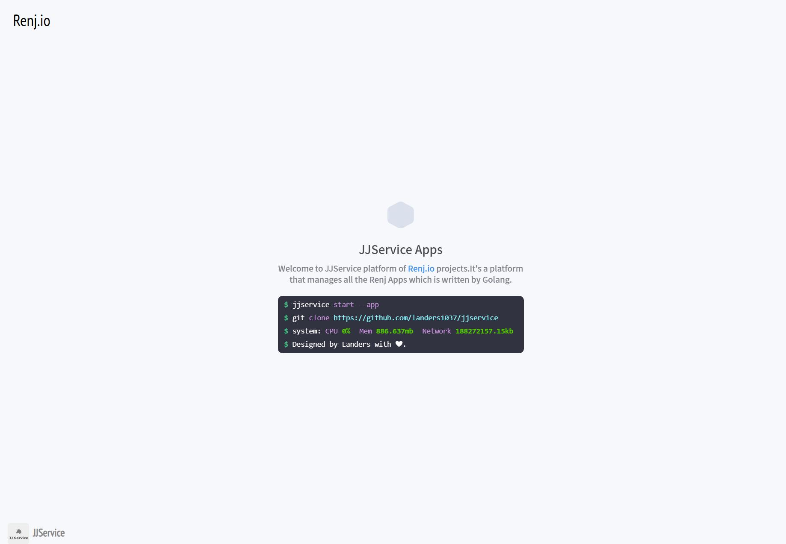
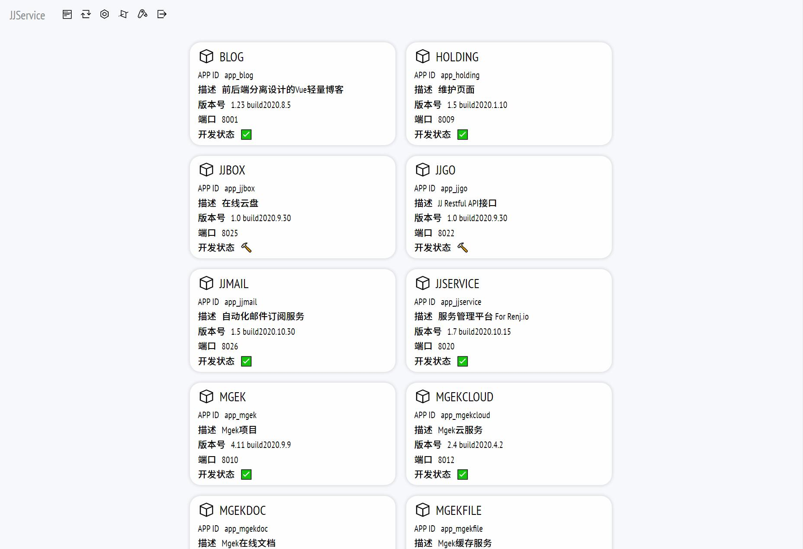
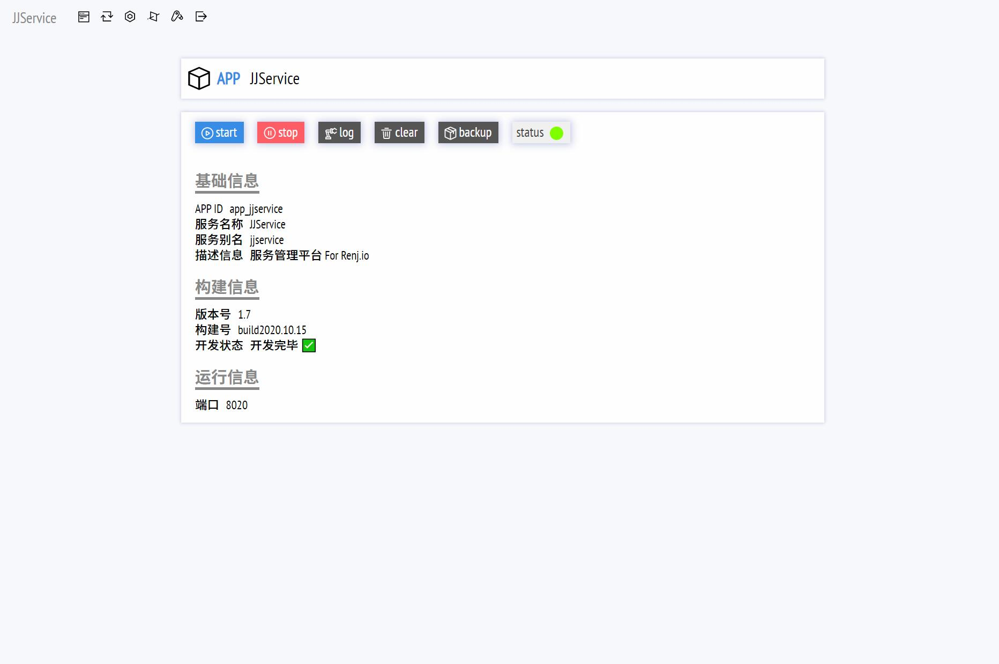

# JJService

## Project setup
```
yarn install
```

### Compiles and hot-reloads for development
```
yarn serve
```

### Compiles and minifies for production
```
yarn build
```

### Customize configuration
See [Configuration Reference](https://cli.vuejs.org/config/).

## JJService Des

什么是JJService？

一个基于shell脚本的微服务管理程序，后端由Go实现，前端由Vue实现

通过简单的集成操作，实现微服务的一体化管理

支持微服务的启动，停止，重启，日志清空，日志查看，备份

**后端暂不开源**

### 微服务配置

使用JSON文件保存每个微服务的信息

```json
{
    "app_id": "app_jjservice",
    "app_name": "JJService",
    "app_des": "jjservice",
    "app_version": "1.0",
    "build_version": "2020.10.10"
    "port": 8080
}
```

### 服务配置

使用`ini`文件配置

```ini
[server]
...
[log]
...
[auth]
```

## JJService Frontend

前端由Vue编写的单页面应用

首页参考一个云端微服务站点

### 演示







### CDN

站点的CDN资源均来自[jsdelivr](https://www.jsdelivr.com/)

